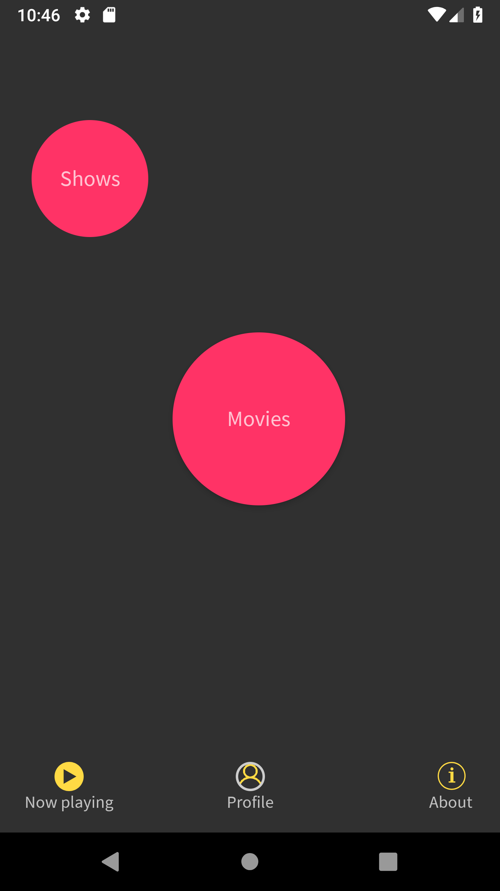
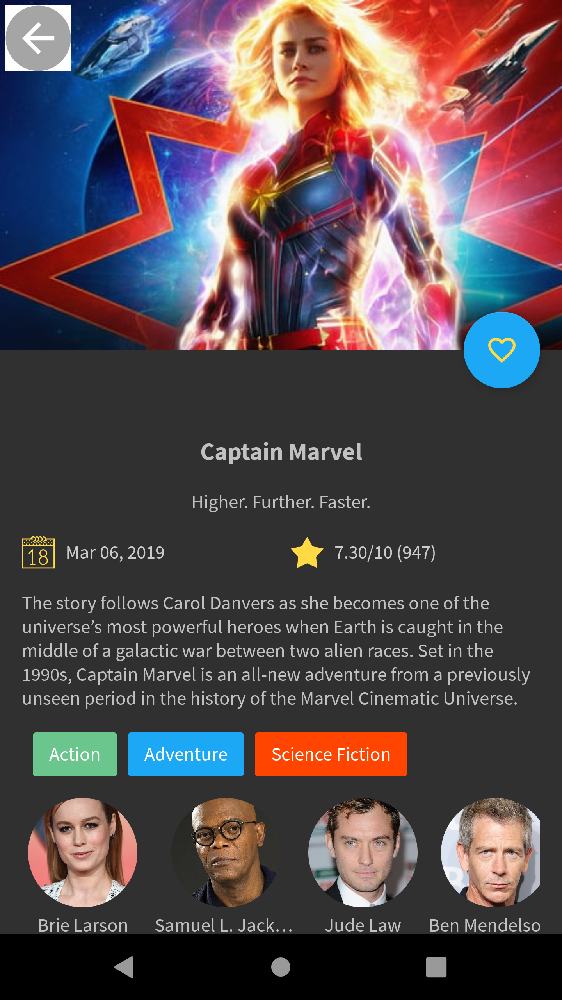
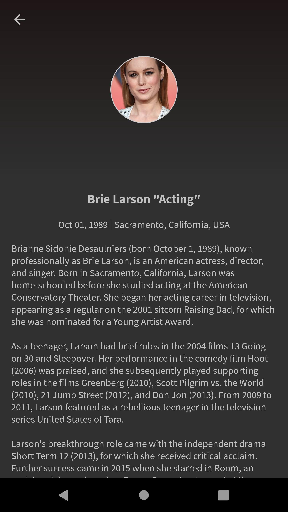
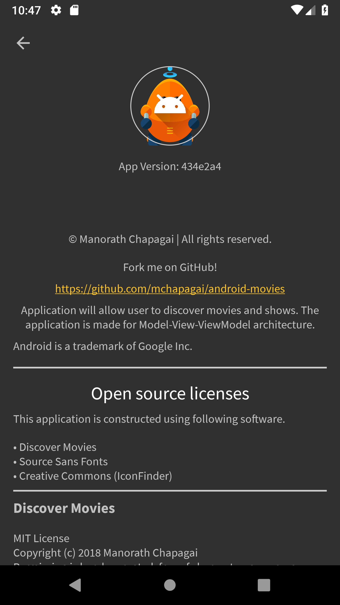
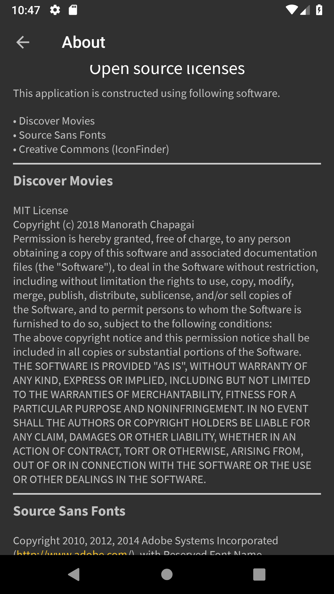

An app to allow users to discover the most popular movies playing.

This application demonstrates understanding of the fundamental elements of programming for Android. Application will communicate with the Internet and provide a responsive and delightful user expericence.

This app will:
- Present the user with a grid arrangement of movie posters upon lunch.
- Allow your user to change sort order via a setting:
  - The sort order can be by most popular or by highest-rated
- Allow the user to tap on a movie poster and transition to a details screen with additional information such as:
  - original title
  - movie poster image thumbnail
  - A plot synopsis (called `overview` in the api)
  - user rating (called `vote_average` in the api)
  - release date
#### The Service
API, that I will be using in this app [**MovieDB**](https://www.themoviedb.org/). Fetch the data from the Internet with the **MovidDB** API, use adapters and custom list layouts to populate list views.

#### Configuration
To set the API key, please refer to `gradle.properties` file and add the key in `API_KEY`
placeholder which is configured in `build.gradle` to be used on the project. Please signup to get the API key.
Signup link: https://www.themoviedb.org/

##### Libraries
- [x] Retrofit 2 (service calls)
- [x] RxJava 2 (reactive programming)
- [x] Gson (JSON parsing)
- [x] ButterKnife (view binding)
- [x] Dagger (dependency injection)

#### Credits
- Icons are downloaded from [ICONFINDER](https://www.iconfinder.com/). [Creative Commons License](https://creativecommons.org/licenses/by/3.0/legalcode)

### Screenshots

    &nbsp;
    &nbsp;
    &nbsp;
    &nbsp;
    &nbsp;
    &nbsp;
    &nbsp;
    

